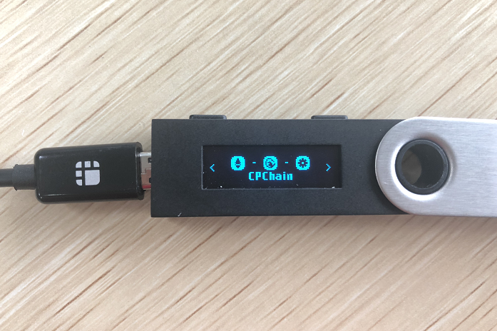
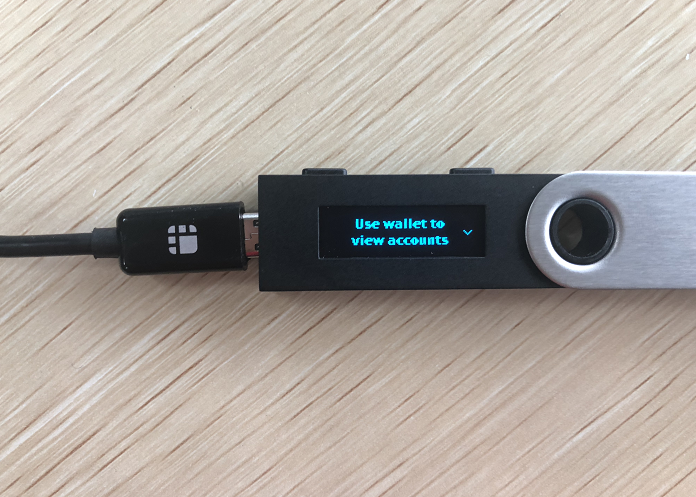
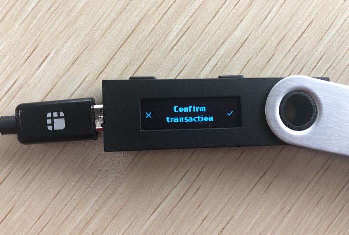
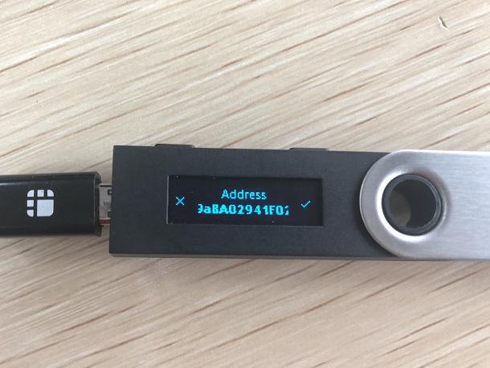
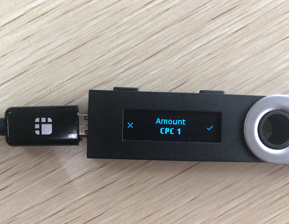

# Connect Ledger Nano S to your CPChain Wallet

The CPChian Web wallet is based on [myetherwallet](https://github.com/kvhnuke/etherwallet.git), and  the CPChain leger application is based on [ledger-app-eth](https://github.com/LedgerHQ/ledger-app-eth.git).

Install the CPChain app on your Ledger device to manage CPC token with the CPChain Web wallet. The CPChain app is developed and supported by the [CPChain team](https://cpchain.io/).

## 1. Before you start

- You've [initialized](https://support.ledger.com/hc/en-us/articles/3600006137933) your Ledger Nano S.
- The latest firmware is [installed](https://support.ledger.com/hc/en-us/articles/3600027311133).
- Ledger Live is [ready to use](https://support.ledger.com/hc/en-us/articles/360006395233).

## 2. Install the CPChain application on your Ledger device

1. Open the Manager in Ledger Live.
2. Connect and unlock your Ledger Nano S.
3. If asked, allow the manager on your device by pressing the right button.
4. Find `CPChain` in the app catalog.
5. Press the `Install` button of the app.
   - An installation window appears.
   - Your device will display `Processing…`
   - The app installation is confirmed.

## 3. Connect device to your CPChain Web wallet

- Open the CPChain application on your Ledger device.

- Open the [CPChain Web wallet](https://wallet.cpchain.io).
- Choose `Send CPC Token`.
- Choose `Ledger Wallet`  and Click `Connect to Ledger Wallet`.
- You now choose the public address you want to use, click confirm on the Web page.

## 4. Use the CPChain wallet

- Your address is displayed on the Web CPChain wallet. You can use it to send CPC.
- To send tokens, enter the amount and receiving address,  then click  `Send`.
- Verify and confirm all transaction details on your Ledger device display.
- Press the right button to sign the transaction.

- Wait and the Ledger display the transaction details.

- Press left button to deny the transaction.

## 5. Contact info

- Support:  info@cpchain.io
